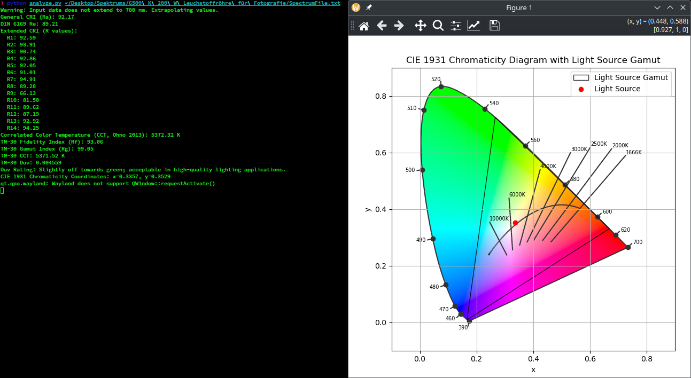
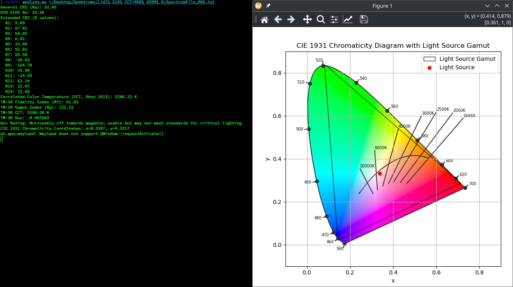
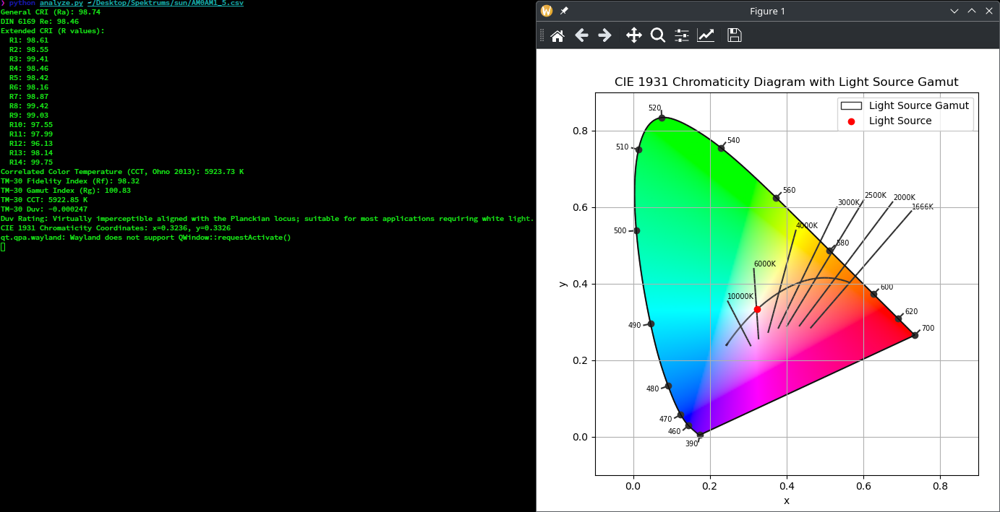

# spectrometer_analysis
Simple spectrometer analysis for Theremino files (e.g. for the "Little Garden" Spectrometer by Mr Kang)


### Dependencies:

- numpy
- colour
- scipy
- matplotlib

### Usage:

```bash
python analyze.py /path/to/SpectrumFile_001.txt
```

### Screenshot:


#### 6500 K CFL 


#### RGB LED @ 6500 K 



#### Sun (ASTM E-490 AM0 Standard Spectra)


